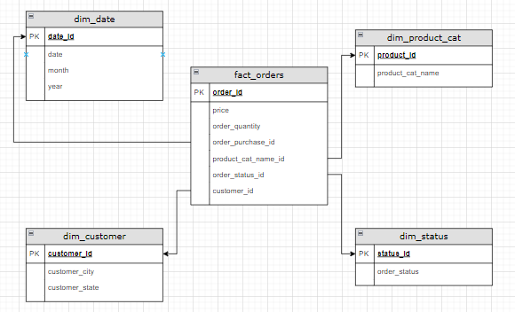

## About

Pada [kumpulan data](/data/) yang diberikan, Saya coba create datamart sederhana untuk dapat menyajikan analisis dari nilai order(price) dan quantity order dari hari ke hari.



## Technology yang digunakan
- docker as containerization
- postgresql & pgadmin as database
- python as programming language
- prefect as data orchestrator

## steps

- clone this repo

- create virt env
```
$ python -m venv venv
```

- activate virt env
```
$ source venv/bin/activate
```  

- install requirements
```
$ pip install -r requirements.txt
```

- running up postgresql and pgadmin [container](pg_db_container/docker-compose.yml)
```
$ cd pg_db_container

$ mkdir data_pgadmin
$ mkdir data_postgresql

$ docker compose up -d

$ sudo chown 5050:5050 data_pgadmin
$ sudo chmod a+rwx data_postgresql
```
- create schemas
```
CREATE SCHEMA stg
    AUTHORIZATION root;

CREATE SCHEMA cln
    AUTHORIZATION root;

CREATE SCHEMA dm
    AUTHORIZATION root;
```

- run server prefect

```
$ prefect server start
```
- run prefect agent
```
$ prefect agent start -p 'default-agent-pool'
```


# create prefect block connection to postgresql

- go to UI localhost:4200 > click + buttons
- add sqlalchemy connector
    * block name = perqara-database
    * driver = SyncDriver > postgresl+psycopg2
    * database = perqara_database
    * username = root
    * password = root
    * host = localhost
    * port = 5432
- save

# ingest raw data to DB
- deploy ingestion [code](/prefect/flows/ingest_to_stg/ingest_to_stg.py) 
```
$ prefect deployment build ingest_to_stg.py:ingest_csv_parent_flow -n "Insert Staging with Params"
```
- apply ingestion .yaml file
```
$ prefect deployment apply ingest_csv_parent_flow-deployment.yaml
```
- go to UI localhost:4200 > Deployment > click three dots in right corner > Quick run   
- input parameters which suitable as on dataset_filename and table_name csv 
    * parameters : 
        1. dataset_filename : customers_dataset, 
        table_name : stg_customers
        2. dataset_filename : geolocation_dataset, 
        table_name : stg_geolocation
        3. dataset_filename : order_items_dataset, 
        table_name : stg_order_items
        4. dataset_filename : order_payments_dataset, 
        table_name : stg_order_payments
        5. dataset_filename : order_reviews_dataset, 
        table_name : stg_order_reviews
        6. dataset_filename : orders_dataset, 
        table_name : stg_orders
        7. dataset_filename : product_category_name_translation_dataset, 
        table_name : stg_product_cat_name_translation
        8. dataset_filename : products_dataset, 
        table_name : stg_products
        9. dataset_filename : sellers_dataset, 
        table_name : stg_sellers
- Run
- Repeat on each dataset

**Note** : make sure dataset path variable in this [code](/prefect/flows/ingest_to_stg/ingest_to_stg.py) match in your current dir.

# clean/transform data

- cd to prefect/flows/2_transform
```
$ cd prefect/flows/2_transform/
```
- execute each python (.py) scripts for transform data

example syntax :
``` 
python cln_stg_customers.py 
```

# create data mart

- cd to prefect/flows/3_dm
```
$ cd prefect/flows/3_dm
```
- execute each python script in sequence

example syntax :
``` 
python 1_dim_date.py 
```


## [requirements](requirements.txt)